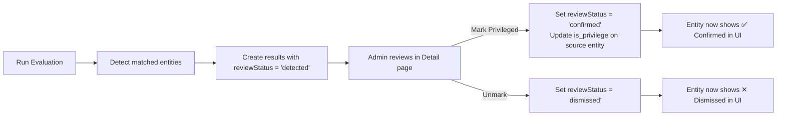

# Fix: Discovery Result Status & Mark/Unmark Privileged Workflow

## Problem

**All detected entities show "Privileged" status** because:

1. `DiscoveryResult.isPrivileged` defaults to `true` (line 60 of model)
2. The evaluation service sets `isPrivileged: true` for every matched entity (line 273)
3. There is **no API endpoint** for Mark/Unmark actions
4. The frontend buttons have **no onClick handlers** — they are just disabled shells

The `is_privilege` field already exists on the dynamic entitlement schema (`Entitlements.js` line 16), and `isPrivileged` exists on the canonical `Entitlement` model (line 42). But these are **never read back** into the discovery result.

## How It Should Work



> [!IMPORTANT]
> Key design: Evaluation creates results as `detected` (not privileged). Admin explicitly **confirms** or **dismisses** each entity. Only confirmed entities update `is_privilege` on the source data.

## Proposed Changes

### Backend: DiscoveryResult Model

#### [MODIFY] [DiscoveryResult.js](file:///d:/Wisi/Wisibility_IGA/icm-backend/src/models/discovery/DiscoveryResult.js)

Replace `isPrivileged: { type: Boolean, default: true }` and remove `severity` with a proper `reviewStatus` field:

```diff
- isPrivileged: { type: Boolean, default: true },
- severity: { type: String, enum: ['LOW', 'MEDIUM', 'HIGH', 'CRITICAL'], default: 'MEDIUM' },
+ reviewStatus: {
+   type: String,
+   enum: ['detected', 'confirmed', 'dismissed'],
+   default: 'detected',
+   index: true,
+ },
+ reviewedBy: { type: mongoose.Schema.Types.ObjectId, ref: 'User' },
+ reviewedAt: { type: Date },
```

| Value | Meaning | UI Display |
|-------|---------|------------|
| `detected` | Just found by evaluation | Chip: "New" (orange outlined) |
| `confirmed` | Admin marked as privileged | Chip: "Privileged" (red) |
| `dismissed` | Admin dismissed (false positive) | Chip: "Dismissed" (grey) |

---

### Backend: Evaluation Service

#### [MODIFY] [discoveryEvaluationService.js](file:///d:/Wisi/Wisibility_IGA/icm-backend/src/services/discoveryEvaluationService.js)

1. **Change result creation**: Set `reviewStatus: 'detected'` instead of `isPrivileged: true`
2. **Remove `severity` from result push**
3. **Preserve previous confirmations**: When re-evaluating, don't delete results that were previously confirmed — carry forward their `reviewStatus` so admin work is not lost
4. **Remove the auto-update of `is_privilege`** on source entities (lines 294-337) — this should only happen when admin explicitly confirms
5. **Fix `runAllDiscoveryPolicies`**: Remove the `status: 'active'` filter since we removed status field

---

### Backend: Controller — New Mark/Unmark Endpoints

#### [MODIFY] [discoveryController.js](file:///d:/Wisi/Wisibility_IGA/icm-backend/src/controllers/discoveryController.js)

Add two new endpoints:

**`PUT /results/mark`** — Mark selected results as confirmed privileged:
- Accepts `{ resultIds: string[] }` in body
- Updates `reviewStatus` to `confirmed`, sets `reviewedBy` and `reviewedAt`
- Updates `is_privilege` field on source dynamic entitlement/user model
- Updates `isPrivileged` on canonical `Entitlement` model

**`PUT /results/unmark`** — Dismiss selected results:
- Accepts `{ resultIds: string[] }` in body
- Updates `reviewStatus` to `dismissed`, sets `reviewedBy` and `reviewedAt`
- Clears `is_privilege` / `isPrivileged` on source entities

---

### Backend: Routes

#### [MODIFY] [discoveryRoutes.js](file:///d:/Wisi/Wisibility_IGA/icm-backend/src/routes/discoveryRoutes.js)

```diff
+ router.put('/results/mark', authenticate, adminDiscovery, discovery.markResults);
+ router.put('/results/unmark', authenticate, adminDiscovery, discovery.unmarkResults);
```

---

### Frontend: API Service

#### [MODIFY] [discoveryService.js](file:///d:/Wisi/Wisibility_IGA/icm-frontend/src/services/discoveryService.js)

```diff
+ markResults: (resultIds) => api.put(`${BASE}/results/mark`, { resultIds }),
+ unmarkResults: (resultIds) => api.put(`${BASE}/results/unmark`, { resultIds }),
```

---

### Frontend: Detail Page

#### [MODIFY] [DiscoveryPolicyDetail.jsx](file:///d:/Wisi/Wisibility_IGA/icm-frontend/src/pages/governance/discovery/DiscoveryPolicyDetail.jsx)

1. **Add Mark Privileged handler**: Calls `discoveryAPI.markResults(selected)`, shows snackbar, reloads results
2. **Add Unmark handler**: Calls `discoveryAPI.unmarkResults(selected)`, shows snackbar, reloads results
3. **Fix status chip rendering**: Use `r.reviewStatus` instead of `r.isPrivileged`
   - `detected` → Orange "New" chip
   - `confirmed` → Red "Privileged" chip  
   - `dismissed` → Grey "Dismissed" chip
4. **Fix status filter**: Filter by `reviewStatus` field instead of `isPrivileged` boolean
5. **Remove `policy.status` chip** from header (status field was removed)

---

## Verification Plan

### Automated Tests
1. Backend syntax check: `node --check` on all modified files
2. Frontend build: `npx vite build`

### Manual Verification
1. Run evaluation → all results show "New" status
2. Select entities → click "Mark Privileged" → status changes to "Privileged" 
3. Select entities → click "Unmark" → status changes to "Dismissed"
4. Status filter dropdown works correctly for each status
5. Re-run evaluation → previously confirmed entities retain their "Privileged" status
6. Check that `is_privilege` on source entitlement data gets updated when confirmed
